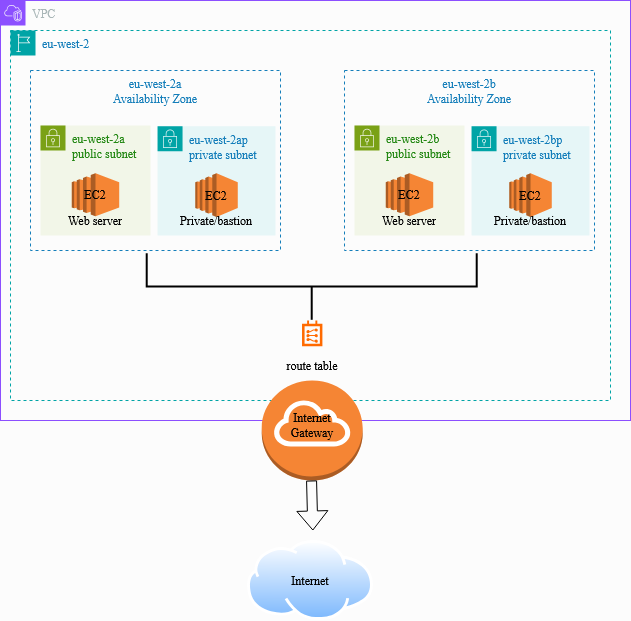

# AWS Networking Foundation

A production-grade VPC built from scratch on AWS, demonstrating core networking concepts including public/private subnet isolation, multi-AZ resilience, bastion host access patterns, and security group layering.

> Part of my SAA build path: hands-on projects replacing exam cram. Each project covers real SAA domains through building, not memorising.

## Network Architecture

**What's built**
- Custom VPC (`10.0.0.0/16`) in `eu-west-2` (London)
- 2 public subnets across `eu-west-2a` and `eu-west-2b`
- 2 private subnets across `eu-west-2a` and `eu-west-2b`
- Internet Gateway attached to the VPC
- Public route table with `0.0.0.0/0 → IGW` route
- EC2 web server in a public subnet
- EC2 private instance in a private subnet (no public IP)
- Bastion host pattern for private instance access
- Security groups with least-privilege rules

## Key Decisions and Why

**Why a custom VPC instead of the default?**  
The AWS default VPC is pre-configured and fine for testing, but real workloads need network isolation you control. Building custom means you understand every route, every rule, and every boundary.

**Why two Availability Zones?**  
A single Availability Zone (AZ) is a single point of failure. Spreading across `eu-west-2a` and `eu-west-2b` means if one AWS data centre has an issue, the architecture survives. This is the foundation of resilience on AWS.

**Why public and private subnets?**  
Not everything should be internet-facing. The web server needs to be reachable by users, and the private instance (which simulates a database) should never be directly accessible from the internet. Subnet separation enforces this at the network level.

**Why restrict SSH to my IP only?**  
Opening SSH (port 22) to `0.0.0.0/0` is one of the most common cloud security mistakes. A brute-force attack can compromise an open SSH port within hours. Restricting to a known IP is the minimum viable security posture.

**Why a bastion host?**  
The private instance has no public IP — there is no direct path from the internet to it. The bastion (public EC2) acts as a controlled jump point. You SSH into the bastion, then hop to the private instance from inside the VPC. This is standard practice for accessing private infrastructure.

## Services Used

| Service | Purpose |
|---|---|
| VPC | Isolated private network |
| Subnets | Network segmentation (public/private) |
| Internet Gateway | VPC connection to the internet |
| Route Tables | Traffic routing rules |
| Security Groups | Instance-level firewall |
| EC2 (Amazon Linux 2023) | Web server and private instance |
| User Data | Bootstrap Apache on launch |

## What I Learned

**Networking clicked here.** Before this project, VPCs felt abstract. Building every component manually — creating the Internet Gateway, writing the route, associating subnets — made the relationship between each piece obvious in a way that reading about it never did.

The moment that landed hardest: SSHing into the public server, then hopping into the private server using only its private IP. Seeing that the private instance was genuinely unreachable from the internet but accessible from inside the VPC made the whole subnet isolation concept real.

**Mistakes I made and fixed**  

## Troubleshooting Log

See [troubleshooting.md](troubleshooting.md) for a full log of issues hit and how they were resolved.

## AWS Solutions Architect Associate Domains Covered

- Design Resilient Architectures (multi-AZ, subnet isolation)
- Networking & Content Delivery (VPC, subnets, IGW, route tables)
- Security (security groups, least privilege, bastion pattern)

## What's Next

**Project 2 — The Scalable Web App**  
Taking this VPC and adding an Application Load Balancer, Auto Scaling Group, and RDS instance. Making it production-grade.

---

*Part of [Ishola's SAA Build Path](https://github.com/SholaAkande) — building towards AWS Solutions Architect Associate through projects, not passive study.*
